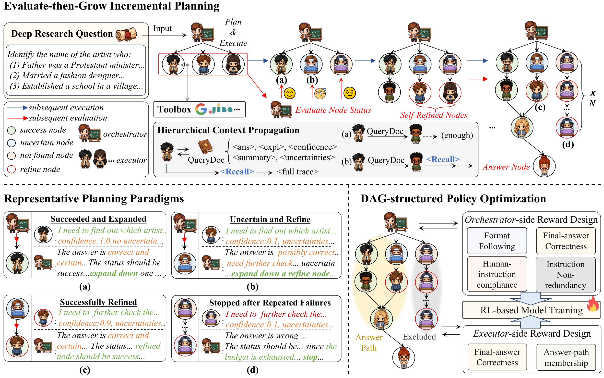

<h1 align="center">
  DAGent: Evaluate-then-Grow Planning <br>
  for Deep Research Agents
</h1>

<p align="center">
  <a href="https://openreview.net/forum?id=gNnU6UhVDm">
    
  </a>
  <a href="LICENSE">
    
  </a>
</p>

<p align="center">
  <a href="#overview">Overview</a> •
  <a href="#news">News</a> •
  <a href="#release-status">Release Status</a> •
  <a href="#installation">Installation</a> •
  <a href="#repository-layout">Repository Layout</a> •
  <a href="#training">Training</a> •
  <a href="#evaluation">Evaluation</a> •
  <a href="#citation">Citation</a> •
  <a href="#acknowledgments">Acknowledgments</a> •
  <a href="#license">License</a>
</p>

<p align="center">
  
</p>

## Overview

Deep research tasks require an agent to search across many sources, combine the evidence, and revise its plan as findings come in. Existing DAG-based agents commit to a task-level plan before execution and repair it only after failures show up. This Plan-then-Patch strategy commits most strongly at the moment the agent knows least, and later repairs spend computation on branches that should never have been planned.

DAGent replaces this with **Evaluate-then-Grow** incremental planning. An Orchestrator grows the task DAG one batch at a time, conditioning every expansion on the confidence and uncertainty that completed nodes report. A hierarchical context layer propagates compact **QueryDocs** between nodes by default and exposes the full **InteractionTranscript** of a node through a `recall` tool only when a downstream node asks for it. Because the graph is append-only, the recorded topology also defines structural RL signals that outcome-only recipes cannot express; **DAGRPO** instantiates them as a topology-conditioned credit on Executor rollouts and a structural compliance regularization on Orchestrator plans.

Across BrowseComp-Plus, GAIA, and xbench-DeepSearch, DAGent surpasses the strongest open-source baseline by 5.3 / 5.8 / 2.0 points at the Qwen3-235B-A22B scale, the lead replicates across four open-source backbones from four vendors and extends to GPT-5 at 327K context, and DAGRPO adds 3.0 average points over a same-budget outcome-only GRPO baseline at the Qwen3-8B scale, at a lower per-task cost than the Plan-then-Patch counterpart.

## News

- **2026-09** DAGent is accepted at NeurIPS 2026 as a poster. The arXiv version of the paper is coming soon.
- **2026-09** First code release: the DAGent workflow, its prompts and tool schemas, the DAGRPO advantage estimator, and the training and evaluation entry points.

## Release Status

This repository currently contains the DAGent-specific code. The remaining parts of the evaluation and training stack are being cleaned up and will be released soon:

- the shared runtime (LLM clients, task context, action execution) and the search backends and LLM judges for BrowseComp-Plus, GAIA, and xbench-DeepSearch;
- the baseline workflows used in the paper (ReAct / Summary agent, Fold Agent, Flash-Searcher) with their prompts, and the controlled-evaluation harness for the official FlowSearch implementation;
- the verl fork with the agent loop and the training configurations;
- the scripts that produce the figures of the paper.

Until then, the commands below document the exact invocations used for the paper rather than a self-contained runnable package. Watch or star the repository to be notified.

## Installation

The paper used Python 3.12 with PyTorch 2.8.0 (CUDA 12.8), vLLM 0.11.0, and FlashAttention 2.8.3. Training additionally needs the verl fork from the upcoming release; `verl/trainer/ppo/core_algos.py` in this repository is the file that replaces its counterpart there.

```bash
conda create -n dagent python=3.12 -y
conda activate dagent

pip install vllm==0.11.0
pip install transformers datasets accelerate safetensors \
    openai tiktoken httpx aiohttp requests \
    pandas "pyarrow>=19.0.0" omegaconf hydra-core pydantic \
    "ray[default]" "tensordict>=0.8.0,<=0.10.0,!=0.9.0" torchdata \
    peft dill codetiming filelock psutil tqdm cachetools wandb
pip install https://github.com/Dao-AILab/flash-attention/releases/download/v2.8.3/flash_attn-2.8.3+cu12torch2.8cxx11abiFALSE-cp312-cp312-linux_x86_64.whl
```

## Repository Layout

```text
DAGent/
├── LICENSE
├── README.md
├── figs/
│   └── figure2.png
├── agents/
│   ├── dagent.py               # Orchestrator + TaskDAG / QueryDoc / RecallTool + structural validator + reward shaping
│   ├── prompts.py              # Orchestrator, ReAct Executor, and Recall prompts
│   └── tool_spec.py            # QueryDoc finish schema, plan tool, and recall tool
├── verl/
│   └── trainer/ppo/core_algos.py   # DAGRPO advantage estimator (Eq. 5 of the paper)
└── scripts/
    ├── eval.py                 # Training-free evaluation entry (all benchmarks and workflows)
    └── train_bc_qwen3_8b.sh    # Training launcher for the five RL workflows of Table 1
```

## Training

**1. Start the search server**

The search server follows the FoldAgent scaffolding and ships with the upcoming release. Start it on a separate machine; it downloads the corpus (`Tevatron/browsecomp-plus-corpus`) and the pre-computed embeddings (`miaolu3/browsecomp-plus`) and loads Qwen3-Embedding-8B on the available GPUs.

```bash
cd envs && python search_server.py \
  --model Qwen/Qwen3-Embedding-8B \
  --corpus Tevatron/browsecomp-plus-corpus \
  --corpus-embedding-dataset miaolu3/browsecomp-plus \
  --host 0.0.0.0 \
  --port 8000
```

Set the environment variables:

```bash
# URL of the local search server (BrowseComp-Plus)
export LOCAL_SEARCH_URL="http://[IP-of-search-server]:8000"

# LLM judge
export JUDGE_API_KEY="your-openai-api-key"
```

**2. Download the training data**

Download and decompress the BrowseComp-Plus 680 / 150 train / test split from the [FoldAgent release](https://github.com/sunnweiwei/FoldAgent), and place the files at `data/bc_train.parquet` and `data/bc_test.parquet`.

**3. Train on BrowseComp-Plus**

Train Qwen3-8B with DAGRPO (2 x H200, LoRA, asynchronous vLLM rollouts):

```bash
bash scripts/train_bc_qwen3_8b.sh dagent_dagrpo        # seed 42 (default)
bash scripts/train_bc_qwen3_8b.sh dagent_dagrpo 123    # seeds used in the paper: 42 / 123 / 777
```

Training workflows (Table 1 of the paper, training-based rows; 21 update steps, three independent seeds):

| Workflow              | Paper row               | Method                                                                                          |
|-----------------------|-------------------------|-------------------------------------------------------------------------------------------------|
| `dagent_dagrpo`       | DAGRPO-DAGent           | DAGent + DAGRPO (α = 0.5 multiplicative off-chain credit + structural compliance regularization) |
| `dagent_grpo`         | GRPO-DAGent             | DAGent + role-separated outcome-only GRPO (α = 1.0, regularization off)                         |
| `search_branch_grpo`  | GRPO-Fold Agent         | Fold Agent + outcome-only GRPO                                                                  |
| `search_grpo`         | GRPO-ReAct Agent (32K)  | ReAct Agent + outcome-only GRPO (default `RESPONSE_LENGTH=32768`)                               |
| `search_grpo`         | GRPO-ReAct Agent (109K) | Same workflow; set `RESPONSE_LENGTH=109568` before launching                                    |
| `search_summary_grpo` | GRPO-Summary Agent      | Summary Agent + outcome-only GRPO                                                               |

## Evaluation

**1. Start the search server**

Required for BrowseComp-Plus only; GAIA and xbench-DeepSearch use web tools. Use the command of the training section.

**2. Set the credentials**

```bash
# Backbone model (any OpenAI-compatible endpoint; the paper used OpenRouter)
export OPENAI_API_KEY="your-backbone-api-key"
export OPENAI_BASE_URL="https://openrouter.ai/api/v1"

# LLM judge (GPT-4o-mini primary, GPT-4.1 tie-breaker)
export JUDGE_API_KEY="your-openai-api-key"

# Web tools (GAIA and xbench-DeepSearch)
export GOOGLE_SEARCH_KEY="your-serper-api-key"
export JINA_API_KEYS="your-jina-api-key"
```

**3. Download the evaluation data**

| Benchmark              | Source                                                                          | Notes                                                             |
|------------------------|---------------------------------------------------------------------------------|-------------------------------------------------------------------|
| BrowseComp-Plus        | https://github.com/sunnweiwei/FoldAgent                                         | 680 train / 150 test split; local search with Qwen3-Embedding-8B  |
| GAIA                   | https://github.com/MiroMindAI/MiroThinker#-benchmark-evaluation                 | 103-task text-only validation subset; web search (Serper + Jina)  |
| xbench-DeepSearch 2505 | https://github.com/MiroMindAI/MiroThinker#-benchmark-evaluation                 | 100 Chinese tasks; web search (Serper + Jina)                     |

Place the parquet files at `data/gaia.parquet` and `data/xbench.parquet`; the BrowseComp-Plus files are already at `data/bc_train.parquet` and `data/bc_test.parquet` from the training step.

**4. Evaluate**

DAGent on BrowseComp-Plus with Qwen3-32B (Table 1 of the paper, Qwen3-32B block, DAGent row):

```bash
python scripts/eval.py \
  --benchmark browsecomp \
  --workflow dagent \
  --model_name qwen/qwen3-32b \
  --data_path data/bc_test.parquet \
  --local_search_url $LOCAL_SEARCH_URL \
  --num_workers 10 \
  --output_dir results
```

Switch the benchmark with `--benchmark {browsecomp, gaia, xbench}` and the backbone with `--model_name {qwen/qwen3-8b, qwen/qwen3-32b, qwen/qwen3-235b-a22b-2507}`.

Workflows (Table 1 of the paper, training-free rows):

| `--workflow`     | Extra flags                | Paper row           |
|------------------|----------------------------|---------------------|
| `dagent`         | —                          | **DAGent (ours)**   |
| `search`         | `--response_length 32768`  | ReAct Agent (32K)   |
| `search`         | `--response_length 109568` | ReAct Agent (109K)  |
| `search`         | `--enable_summary`         | Summary Agent       |
| `search_branch`  | —                          | Fold Agent          |
| `flash_searcher` | —                          | Flash-Searcher      |

The baseline workflows and the FlowSearch harness are part of the upcoming release (see [Release Status](#release-status)).

## Citation

If you find this repository useful, please cite the paper:

```bibtex
@inproceedings{liu2026dagent,
  title     = {{DAGent}: Evaluate-then-Grow Planning for Deep Research Agents},
  author    = {Liu, Hanwen and Sun, Yuanfu and Tan, Qiaoyu},
  booktitle = {Advances in Neural Information Processing Systems (NeurIPS)},
  year      = {2026}
}
```

## Acknowledgments

This implementation builds on [verl](https://github.com/volcengine/verl) and follows the search-server scaffolding of [FoldAgent](https://github.com/sunnweiwei/FoldAgent). Benchmark data comes from the upstream releases: BrowseComp-Plus (train and test) from [FoldAgent](https://github.com/sunnweiwei/FoldAgent), GAIA and xbench-DeepSearch from [MiroThinker](https://github.com/MiroMindAI/MiroThinker). We also thank the open-source community for the libraries this project builds upon.

## License

This project is released under the Apache License 2.0. Please see [LICENSE](LICENSE).
